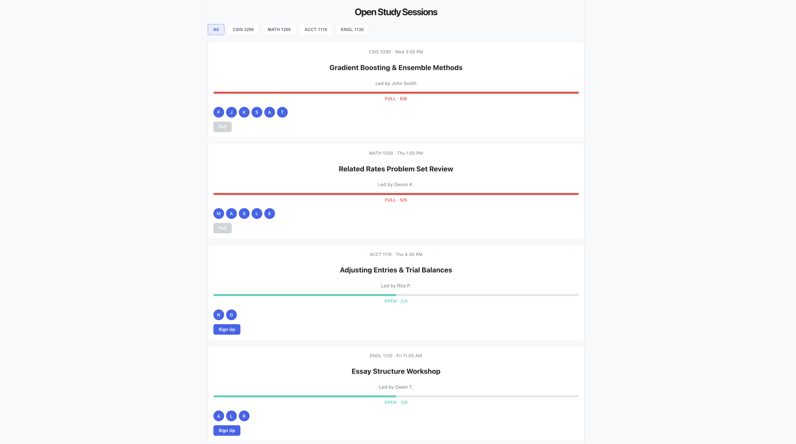
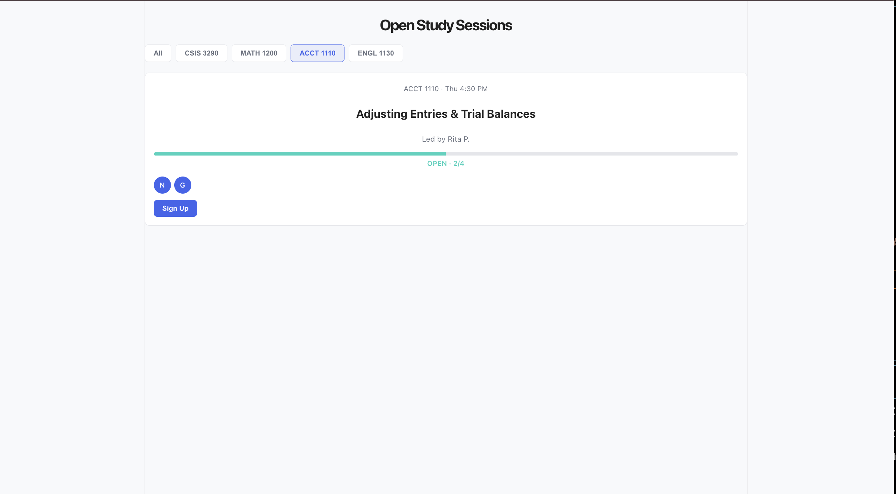

# Peer Tutoring App

Full-stack web app for browsing and joining peer-led study sessions with live capacity tracking.

## Features

- Browse open study sessions by course
- Filter sessions by course tab (All / CSIS 3290 / MATH 1200 / etc.)
- See real-time capacity for each session (e.g. "4/6") with a visual capacity bar
- Join a session with one click; the roster and capacity update immediately
- Full sessions are visually marked and disabled from further sign-ups

## Tech Stack

**Frontend:** React (Vite), plain CSS with CSS custom properties for theming

**Backend:** ASP.NET Core Web API (C#) — *in progress*

**Planned:** routing (login, dashboard, session details), persistent data storage

## Screenshots





## Project Structure

```
peer-tutoring-app/
  client/     — React frontend (Vite)
  server/     — ASP.NET Core Web API backend
```


## Running Locally

**Frontend:**
```bash
cd client
npm install
npm run dev
```

**Backend:**
```bash
cd server
dotnet run
```

## Status

This project is under active development as part of my learning/portfolio work. Currently implemented: the frontend dashboard (session browsing, filtering, join flow) with mock data. Next up: ASP.NET Core backend integration, routing, and authentication.

## About

Built by Sam, a Computing Studies and Information Systems student at Douglas College, as a portfolio project ahead of co-op applications.